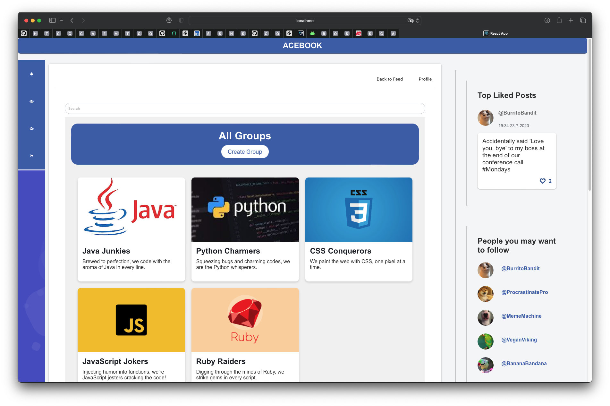

# ACEBOOK - Social Media Application

ACEBOOK is a comprehensive social media application where users can create posts, like and comment on posts, manage their profile, and receive notifications.

<p align="center">
 
 
   
 
 
 
 
</p>

The application is built with a React.js frontend, and an Express.js backend with a set of REST APIs.

<div align="center">
    
</div>

## Table of Contents
- [Features](#features)
- [UI Examples](#ui-examples)
- [Getting Started](#getting-started)
- [Running the tests](#running-the-tests)
- [Contributing](#contributing)
- [License](#license)

## Features

- **User Authentication**: Signup/Login/Logout functionality using JWT for token-based authentication.
- **User Profiles**: Each user has a profile page where they can update their profile picture and manage their information.
- **Posts**: Users can create posts with text and image content. They can also like posts.
- **Comments**: Users can comment on posts and like comments.
- **Groups**: Users can create and join groups, post content on group pages, and even post as the group on the main feed.
- **Follow System**: Users can follow other users, and a list of followers can be viewed in the side menu.
- **Notifications**: Users receive notifications for various activities related to their posts and interactions with other users.
- **Search**: Users can search posts based on keywords.

## UI Examples

### Group Pages
<div align="center">
    
    
</div>

### User Profiles
<div align="center">
    
</div>

### Various Modals
<div align="center">
    
    
</div>

## Getting Started

These instructions will get you a copy of the project up and running on your local machine for development and testing purposes.

### Prerequisites

- Node.js
- npm

### Installation

1. Clone the repository:

   ```bash
   git clone https://github.com/Shakhrai8/acebook.git
   ```

2. Install dependencies in both the frontend and backend directories:

   ```bash
   cd frontend && npm install
   cd ..
   cd api && npm install
   ```

3. Create a `.env` file within the `api` directory:

   ```bash
   echo JWT_SECRET=your_secret_key > .env
   ```

   Replace `your_secret_key` with a strong, unique value. This will be used for token-based authentication.

4. Start the frontend and backend servers:

   - Frontend:

     ```bash
     cd frontend && npm start
     ```

   - Backend:

     ```bash
     cd api && npm run start:test
     ```

The application will start on `localhost:3000` (React app) and `localhost:5000` (Express app).

## Running the tests

We use Jest for backend testing and Cypress for frontend end-to-end testing.

- To run backend tests (need to specify the key token in order to run the test):

  ```bash
  cd api && jest
  ```

- To run frontend tests:

  ```bash
  cd frontend && npx run cypress run
  ```

## Contributing

Contributions to ACEBOOK are welcome! If you have any suggestions, bug reports, or feature requests, please open an issue or submit a pull request.

## License

ACEBOOK is licensed under the MIT License. See [LICENSE](LICENSE) for more information.

